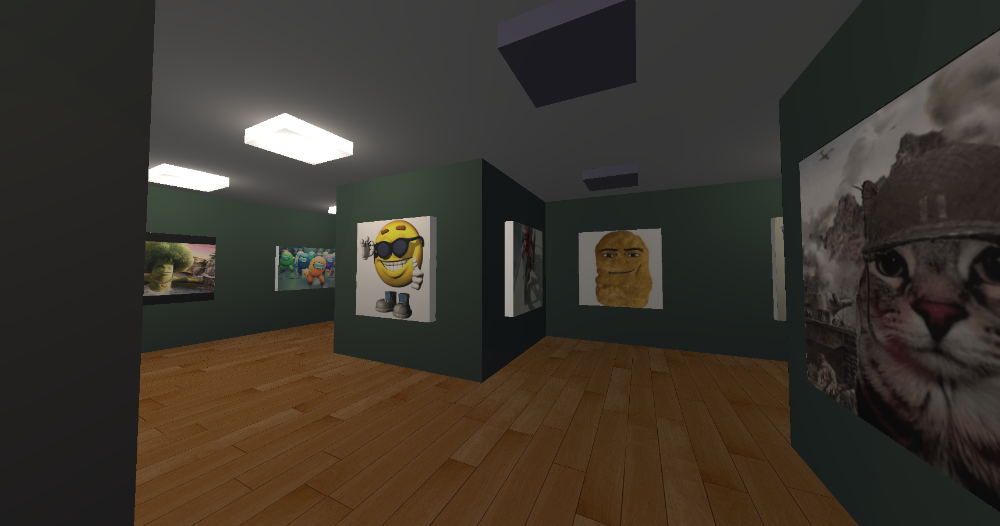
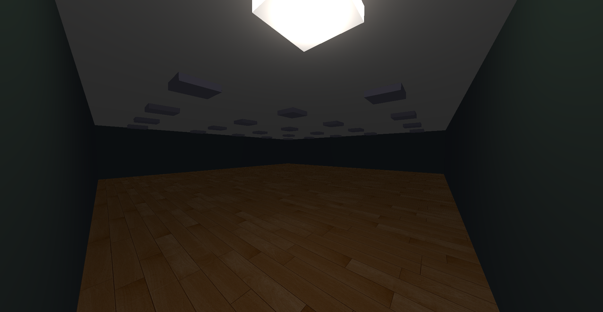
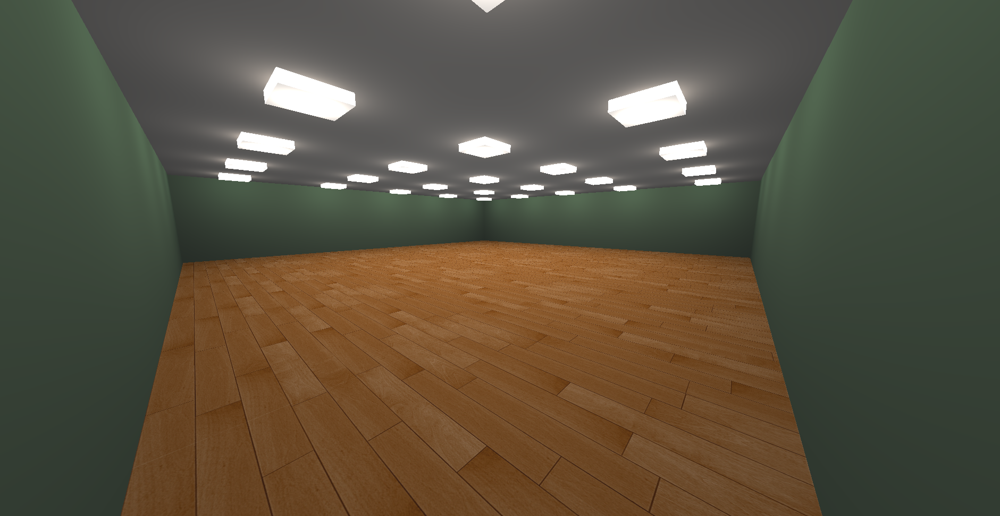

Modified by: Maythas Wangcharoenwong 20241125
# Image Gallery Builder
--------
This program takes in scene data and renders out an Image Gallery scene using the corresponding textures provided in the directory.  

Test Scene 1 

--------

### Components

Since we were initially told to not use any external libraries, I have provided 2 homemade libraries which are not fully tested (which can be implied that there might be some edge cases I know not of.)   
  
The two libraries are provided under `./lib`
1. `lin_alg`: This library provides very basic functionalities that helps with linear algebra and graphics work, it can be used using `lin_alg` namespace
2. `simple_scene`: This library provides basic components for creating a simple scene. Despite its name, it does not provide a scene class. You can use this library using `ss` namespace.
 

The shaders are provided under `./project_1_image_gallery_builder/resources/shader_source`

※ Disclaimer: I DO NOT OWN ANY TEXTURES PROVIDED IN THIS PROJECT.

--------
### Running 
There are two options for running the program. 
1. Providing your own scene, you can do this by providing 2 arguments as follows:
  -  `./<Program> <scene_data_path> <texture_dir>`
2. Using default scene, simply run:
  - `./<Program>`

--------
### Setting up your own scene!
To create your own, simply do two things. 
1. Provide a directory with textures you wish to use and add in textures.  
  For instance: `./scene/test_scene_tex`
2. Provide a file for scene building using the following commands.  
 - The index of each room will be read in row-major form.
 - The file input will behave similar to those of state machines. The value of each temporary variable will stay the same as the previous for every function call until a new value is defined.
   -  However, there is one exception when defining images, images will always be reset after `build_room` function call.
   -  The image will only get rendered if a wall in that direction exist.
   -  The image setting function calls are optional.

| Commands                             | Description                                                                         |
|--------------------------------------|-------------------------------------------------------------------------------------|
| `# <something>`                      | These are comments                                                                  |
| `dimension <row> <col>`              | Setup dimensions of the scene (this must be done as the first thing.                |
| `index <row> <col>`                  | Room position `<row>` `<col>`                                                       | 
| `light_on <0 or 1>`                  | Set light on or off `{off: 0, on: 1}`                                               | 
| `wall <top> <bottom> <left> <right>` | Set whether a wall exist in the corresponding direction `{wall_off: 0, wall_on: 1}` | 
| `image_top <filename.type>`          | Set the image on top with the corresponding `<filename.type>`                       |
| `image_bottom <filename.type>`       | Set the image on bottom with the corresponding `<filename.type>`                    |
| `image_left <filename.type>`         | Set the image on left with the corresponding `<filename.type>`                      |
| `image_right <filename.type>`        | Set the image on right with the corresponding `<filename.type>`                     |

For example scenes, you may use the scenes provided in:  
`./scene/<scene_name>` and `./test_scene_tex` ※ Considering if you are running from visual studio.

----------

### Controls

| Commands                             | Description                                                                         |
|--------------------------------------|-------------------------------------------------------------------------------------|
| `W`                                  | Move forward                                                                        |
| `A`                                  | Move left                                                                           |
| `S`                                  | Move backwards                                                                      | 
| `D`                                  | Move right                                                                          | 
| `esc`                                | Exit focus mode if focus mode is on, otherwise exit program.                        | 
| `click on screen`                    | Enter focus mode.                                                                   | 
| `mouse movement`                     | Rotate camera.                                                                      |

- Focus mode will make your cursor disappear, you can only move or interact when focus mode is on.

----------

### Example Result

Test Scene 2

 

Test Scene 2 if the room is filled with light

 

--------
